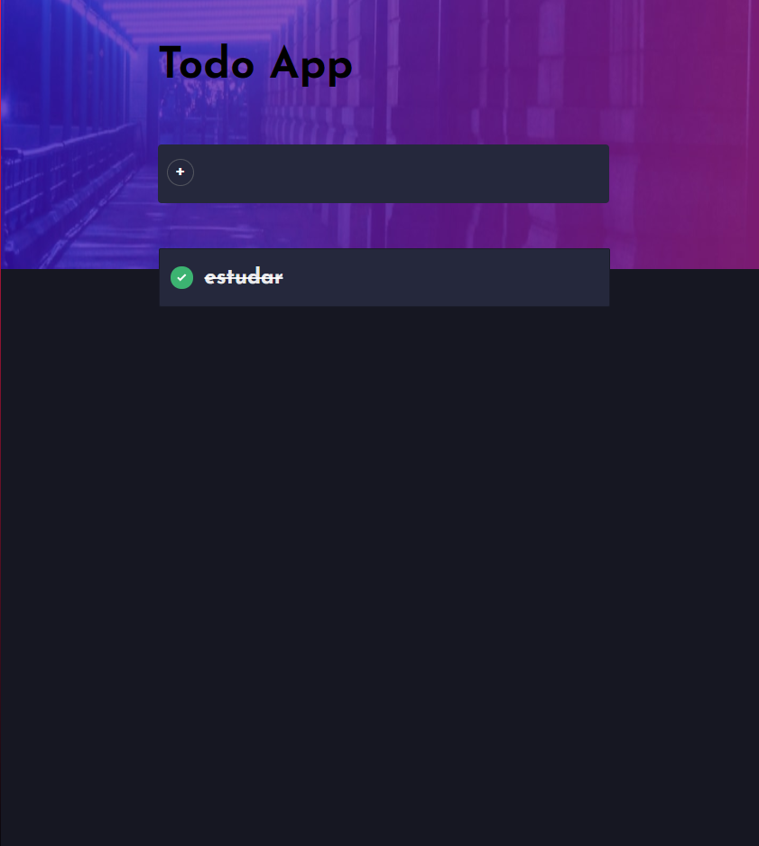

<div id="top"></div>


## Sobre o projeto


<div align="center"><a href="#top">


>Todo App utilizando React.
</a></div>

<a href="https://todolist-react-mikael.netlify.app" target="_blank">
    
  </a>

<p align="left">(<a href="https://homepage-tesla-clone.netlify.app">Clique aqui para abrir um demontraçâo</a>)</p>


##🚀 Tecnologias


* ReactJs
* Hooks
* Local Storage
* Material-UI


<p align="right">(<a href="#top">back to top</a>)</p>


<


### Como usar

2. Clone o repositorio
   ```sh
   git clone https://github.com/MikaelSantos1/tesla-clone.git
   ```
3. Instale as  depencias
   ```sh
   npm install
   ```
4. Inicie o projeto
   ```js
   npm start
   ```

<p align="right">(<a href="#top">back to top</a>)</p>
